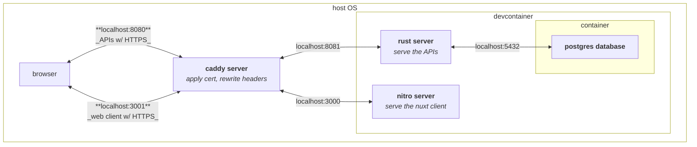
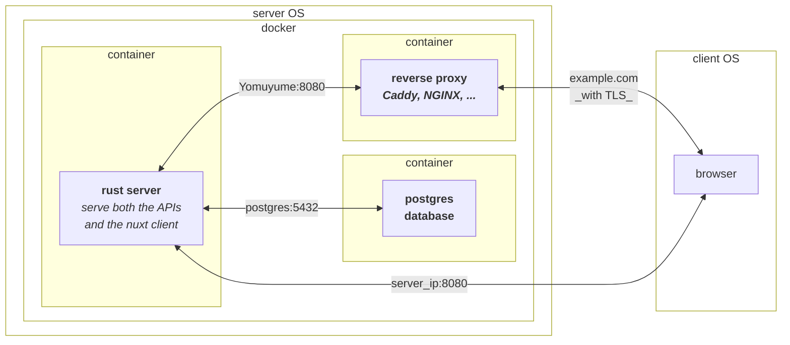
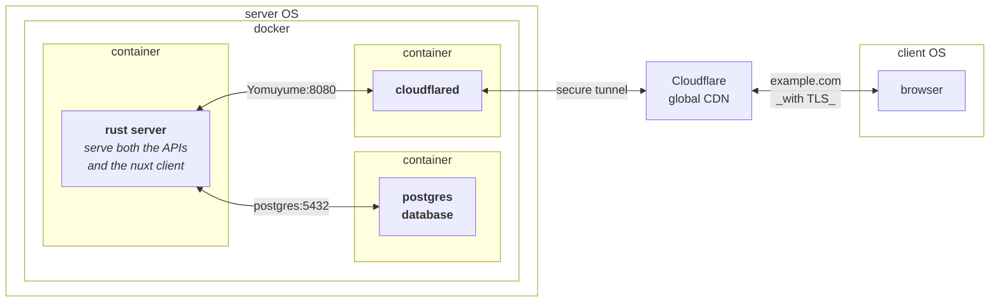

# development

## environment
highly recommended to use vscode + devcontainer.

## non-rust-or-js dependencies
- [dav1d](https://code.videolan.org/videolan/dav1d) for the [image](https://crates.io/crates/image) crate to decode `avif` images and encode in blurhash.
- [7zz](https://www.7-zip.org/download.html) CLI for interacting with archive files.

automatically handled by the `.devcontainer/postinstall.sh` script.

## architectures

  
development

- why Caddy in the middle? search the internet for `cookies samesite=none secure`.
- if you're using wsl, run caddy **on windows, not inside wsl** for it to install the cert into the windows certificate store.
- the command: `caddy run --config Caddyfile`

  
production

- freely choose where to put the reverse proxy, I just prefer it to be in a container rather than the host OS of the server.
- skip the reverse proxy entirely and use `your_server_hostname:8080` or `your_server_ip:8080` directly if that's your thing.

  
production w/ Cloudflare tunnel

- one advantage of this is if you use Cloudflare access to protect applications running on your server, Yomuyume (in the future) can read the authentication headers from Cloudflare and access the app directly without re-login.

## repo structure
- `.devcontainer/`: everything needed for the development environment (`mold` linker, `dav1d`, `7zz`, etc.)
- `benches/`: some micro benchmarks
- `database/`: schemas, migrations `.sql` files
- `src/`: the nuxt spa web client
- `src-rust/`: the rust server

## interact with the database
using `sqlx::query!()` to achieve compile-time syntactic and semantic checks, but it can only interact with one database inside a Postgres server at a time (there's only one `DATABASE_URL` env var).

as a result, we share the same database for the backend itself and the benchmarks, so try to keep everything in `database/` neat and tidy. `sqltools` allows you to `Run Selected Query` in the context menu, use that.