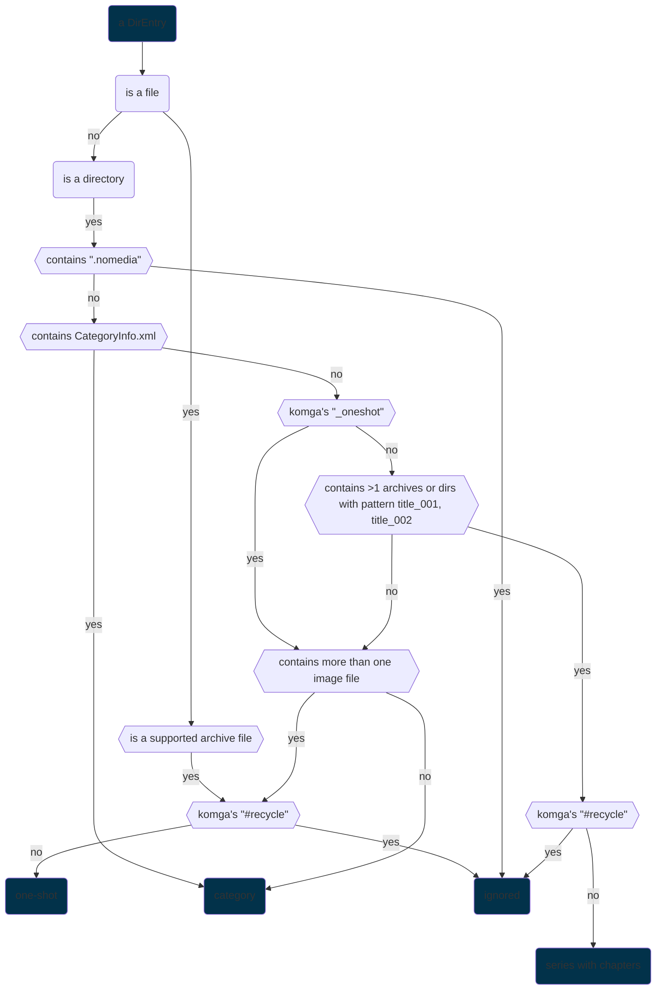

## `DirEntry` guesser decision tree diagram

> no, the diamond shaped blocks are too big.

```mermaid
flowchart TD
    dir@{ shape: rounded, label: "a DirEntry" }
    series@{ shape: rounded, label: "series with chapters" }
    oneshot@{ shape: rounded, label: "one-shot" }
    category@{ shape: rounded, label: "category" }
    ignore@{ shape: rounded, label: "ignored" }

    recycle-oneshot@{ shape: hex, label: "komga's \"#recycle\"" }

    dir --> isfile@{ shape: rounded, label: "is a file" }

    isfile --> |yes| supportedarchive@{ shape: hex, label: "is a supported archive file" }
    supportedarchive --> |yes| recycle-oneshot
    recycle-oneshot --> |yes| ignore
    recycle-oneshot --> |no| oneshot

    isfile --> |no| isdir@{ shape: rounded, label: "is a directory" }
    isdir --> |yes| has-nomedia@{ shape: hex, label: "contains \".nomedia\"" }

    has-nomedia --> |no| catinfo@{ shape: hex, label: "contains CategoryInfo.xml" }
    has-nomedia --> |yes| ignore

    catinfo --> |yes| category
    catinfo --> |no| komga-oneshot@{ shape: hex, label: "komga's \"_oneshot\"" }
    komga-oneshot --> |yes| pagecount

    komga-oneshot --> |no| haspattern@{ shape: hex, label: "contains >1 archives or dirs with pattern title_001, title_002" }

    %% it's a series
    haspattern --> |yes| recycle-series@{ shape: hex, label: "komga's \"#recycle\"" }
    recycle-series --> |yes| ignore
    recycle-series ---> |no| series

    %% not a series; one-shot || category
    haspattern ---> |no| pagecount@{ shape: hex, label: "contains more than one image file" }
    pagecount ---> |yes| recycle-oneshot
    pagecount ----> |no| category

    style dir fill:#02324a
    style series fill:#02324a
    style oneshot fill:#02324a
    style category fill:#02324a
    style ignore fill:#02324a
```
