# managing your library

## metadata
this application uses

-   a slightly extended version of the latest version of `ComicInfo.xml` schema as the source of truth to manage titles' metadata. one the library scanning is completed, there should exists inside each title a `ComicInfo.xml` along with the schema link at the top.

    open them with [vscode](https://code.visualstudio.com/) with the [XML](https://marketplace.visualstudio.com/items?itemName=redhat.vscode-xml) extension to have type hinting or use the frontend client.

-   same thing with categories' metadata using `CategoryInfo.xml`

## library structure
it should feels as natural as possible
-   pages put inside a directory or an archive file to make a title
-   titles with similar names put inside a directory to make a series
-   else they form a category of one-shots

---

if you don't enable any of the Komga's compatibility features, for a directory to be

-   a series if all the sub-directories and archive files inside follows a naming pattern of `<optional-basnename><chapter_number>`

    extensions are ignored so this is a valid series:
    - `foo/chapter_001`
    - `foo/chapter_002.cbz`
    - `foo/chapter_003.7z`

    basenames are lowercased and filter out all non-alphanumeric characters so this is also valid:
    - `foo/Story-001`
    - `foo/story 002.cbr`
    - `foo/story_003.zip`

    example of not a valid one
    - `foo/story 001`
    - `foo/story 002.cbr`
    - `foo/a story 003.zip`

-   a category if
    -   there's explicitly a `CategoryInfo.xml` file
    -   it doesn't have the pattern and the directory contains at most 1 image file (for the cover page)

-   a one-shot if more than 1 image file

## special features
-   an empty `.nomedia` file is placed in a directory to ignore the entire directory tree, or in a supported archive file to ignore the archive to be included in the application. this feature is **disabled by default** in the settings page in the frontend.

that's it! it should require no more hackery wizardry features to managing your library.

## Komga compatibility features
for both Komga's `#recycle` and `_oneshot` in directory paths

-   Prefix to ignore only the directory itself

    `/my-library/#recycle foo/bar/baz` -> only `#recycle foo` is ignored

-   Anywhere in the path but prefix to ignore the whole directory tree

    `/my-library/foo #recycle foo2/bar/baz` -> all `foo #recycle foo2`, `bar` and `baz` are ignored

`_oneshot` and `#recycle` are only applied when dealing with series or one-shots. If the application detects a `DirEntry` is a category, then it's a category. Both features are **disabled by default** in the settings page in the frontend.

the Mylar's `series.json` will be supported in the far future.

## `DirEntry` guesser decision tree diagram
> no, the diamond shaped blocks are too big.

```mermaid
flowchart TD
    dir@{ shape: rounded, label: "a DirEntry" }
    series@{ shape: rounded, label: "series with chapters" }
    oneshot@{ shape: rounded, label: "one-shot" }
    category@{ shape: rounded, label: "category" }
    ignore@{ shape: rounded, label: "ignored" }

    recycle-oneshot@{ shape: hex, label: "komga's \"#recycle\"" }

    dir --> isfile@{ shape: rounded, label: "is a file" }

    isfile --> |yes| supportedarchive@{ shape: hex, label: "is a supported archive file" }
    supportedarchive --> |yes| recycle-oneshot
    recycle-oneshot --> |yes| ignore
    recycle-oneshot --> |no| oneshot

    isfile --> |no| isdir@{ shape: rounded, label: "is a directory" }
    isdir --> |yes| has-nomedia@{ shape: hex, label: "contains \".nomedia\"" }

    has-nomedia --> |no| catinfo@{ shape: hex, label: "contains CategoryInfo.xml" }
    has-nomedia --> |yes| ignore

    catinfo --> |yes| category
    catinfo --> |no| komga-oneshot@{ shape: hex, label: "komga's \"_oneshot\"" }
    komga-oneshot --> |yes| pagecount

    komga-oneshot --> |no| haspattern@{ shape: hex, label: "contains >1 archives or dirs with pattern title_001, title_002" }

    %% it's a series
    haspattern --> |yes| recycle-series@{ shape: hex, label: "komga's \"#recycle\"" }
    recycle-series --> |yes| ignore
    recycle-series ---> |no| series

    %% not a series; one-shot || category
    haspattern ---> |no| pagecount@{ shape: hex, label: "contains more than one image file" }
    pagecount ---> |yes| recycle-oneshot
    pagecount ----> |no| category

    style dir fill:#02324a
    style series fill:#02324a
    style oneshot fill:#02324a
    style category fill:#02324a
    style ignore fill:#02324a
```

