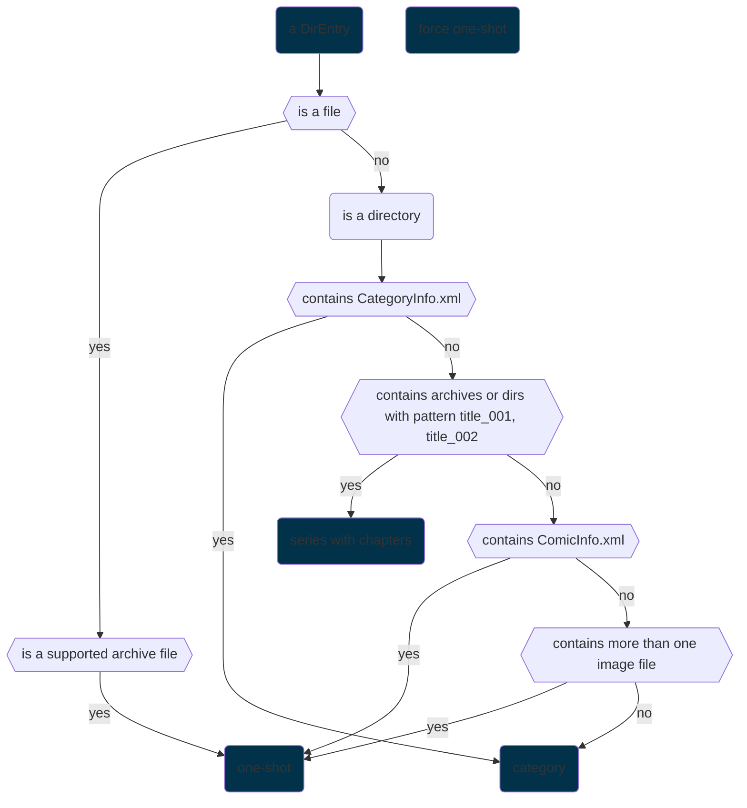

# Directory Guesser

> No, the diamond shaped ones are too big.

- `Ignored` cases are ignored.
- Explicit flags `.nomedia`, `_oneshot` and `#recycle` are ignored in this diagram.

```mermaid
flowchart TD
    dir@{ shape: rounded, label: "a DirEntry" }
    series@{ shape: rounded, label: "series with chapters" }
    oneshot@{ shape: rounded, label: "one-shot" }
    alloneshot@{ shape: rounded, label: "force one-shot" }
    category@{ shape: rounded, label: "category" }

    dir --> isfile@{ shape: hex, label: "is a file" }

    isfile --> |yes| supportedarchive@{ shape: hex, label: "is a supported archive file" }
    supportedarchive --> |yes| oneshot

    isfile --> |no| isdir@{ shape: rounded, label: "is a directory" }

    isdir --> catinfo@{ shape: hex, label: "contains CategoryInfo.xml" }

    catinfo --> |yes| category
    catinfo --> |no| haspattern@{ shape: hex, label: "contains archives or dirs with pattern title_001, title_002" }

    haspattern --> |yes| series
    haspattern --> |no| cominfo@{ shape: hex, label: "contains ComicInfo.xml" }

    cominfo --> |yes| oneshot
    cominfo --> |no| pagecount@{ shape: hex, label: "contains more than one image file" }

    pagecount --> |yes| oneshot
    pagecount --> |no| category

    style dir fill:#02324a
    style series fill:#02324a
    style oneshot fill:#02324a
    style alloneshot fill:#02324a
    style category fill:#02324a
```